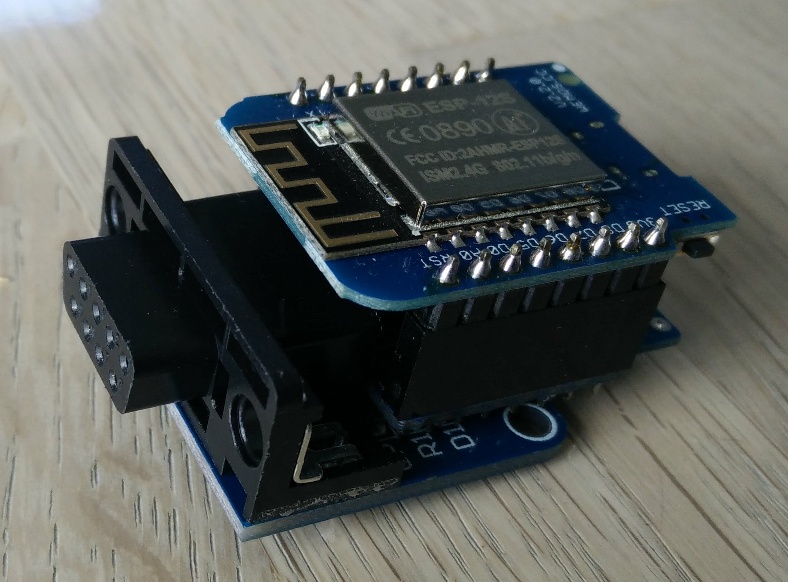

# benq

This is a sketch for controling/reading a benq projector using an esp8266, and the serial port

## Requirements
Install https://github.com/bloft/EasyMqtt as a library

## Hardware
The hardware consistes of A Wemos D1 Mini, Wemos proto shield, and a RS232 board



## Example mqtt data

```
easyMqtt/15768393/power ON
easyMqtt/15768393/model W1110S
easyMqtt/15768393/source RGB
easyMqtt/15768393/lamp/mode LNOR                                                                                                                                                                                                                                               
easyMqtt/15768393/lamp/time 84                                                                                                                                                                                                                                                 
easyMqtt/15768393/audio/mute OFF                                                                                                                                                                                                                                               
easyMqtt/15768393/audio/volume 10                                                                                                                                                                                                                                              
easyMqtt/15768393/picture/aspect AUTO                                                                                                                                                                                                                                          
easyMqtt/15768393/picture/sharpness 15                                                                                                                                                                                                                                         
easyMqtt/15768393/picture/brightness 50                                                                                                                                                                                                                                        
easyMqtt/15768393/picture/contrast 50                                                                                                                                                                                                                                          
easyMqtt/15768393/picture/mode FOOTBALL   
```


